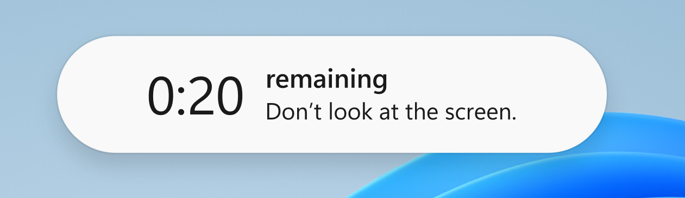
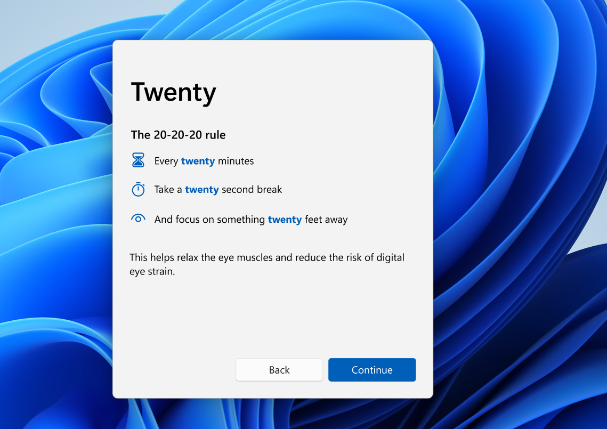

# Twenty 👀

[![style: very good analysis][very_good_analysis_badge]][very_good_analysis_link]
[![License: MIT][license_badge]][license_link]

Twenty is an open source Windows application designed to help you follow the [20-20-20 rule](https://www.medicalnewstoday.com/articles/321536), a simple method to prevent eye strain by taking regular breaks. 

## Features

- Visual and audible notifications that remind you to relax your eyes 🏝️
- Beautiful native design 🎨
- free and open source 🎉

## Screenshots

## Getting Started

You can download Twenty from the [releases](https://github.com/RoundedInfinity/twenty/releases).

You can also compile the source code yourself, by following these steps:

1. Install [flutter](https://flutter.dev/).
2. Clone this repository
3. Run `flutter pub get` in the app directory
4. Run `flutter run` to start the app

## Contributing

Contributions are welcome from everyone interested in improving this app.

Especially for porting this app to macOS and Linux help is needed. 

[license_badge]: https://img.shields.io/badge/license-MIT-blue.svg
[license_link]: https://opensource.org/licenses/MIT
[very_good_analysis_badge]: https://img.shields.io/badge/style-very_good_analysis-B22C89.svg
[very_good_analysis_link]: https://pub.dev/packages/very_good_analysis